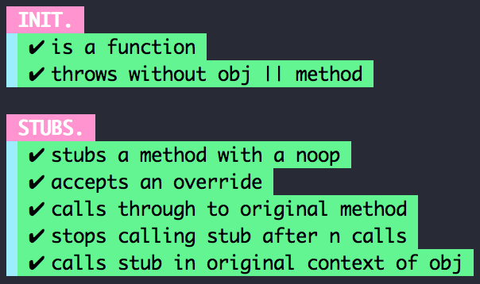

# tess

> Simple test runner.



## Use
```sh
$ npm install --save-dev tess
```
```js
// test.js

var assert = require('assert')
var tess = require('tess')

tess(function(it) {
  it('works', function() {
    assert(true)
  })
})
```

## API

### var results = tess([opts ,] suite)

#### opts
- (optional)
- Type: `Object|String`

##### opts.name
- Type: `String`
A label for this suite of tests. You may also pass this in in place of the `opts` object.

##### opts.shh
- Type: `Boolean`
Won't print test results to stdout.

#### suite
- Type: `Function`
Encapsulates all of your tests.

When invoked, this function will receive a function as its first argument.

##### suite(function(title, fn) {})

###### title
- Type: `String`
The name to assign to your test.

###### fn
- Type: `Function`
The function that wraps your assertions.

#### results
- Type: `Array`
The results of all of your tests after running them.

##### results[].fn
- Type: `Function`
The function that was tested.

##### results[].success
- Type: `Boolean`
Signals if the test succeeded or failed.

##### results[].title
- Type `String`
The name of the test that was run.

##### results[].error
- Type: `Object`
If the test failed, this contains the error object.